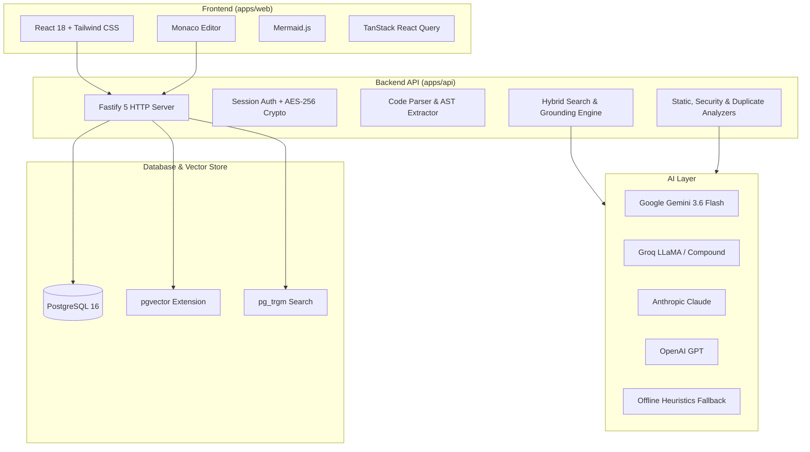

# Technologies Used & Architectural Rationale

This document provides a comprehensive overview of every technology, library, and framework used in **Codebase AI**, along with the architectural rationale for why each was chosen.

---

## 🏗️ Architecture Overview

---

## 1. Frontend Layer (`apps/web`)

| Technology | Purpose | Why It Was Chosen |
|---|---|---|
| **React 18** | Core UI Framework | Component-based architecture, extensive developer ecosystem, concurrent rendering features, and predictable state transitions. |
| **TypeScript 5** | Programming Language | Compile-time type safety across UI models, API responses, and editor interactions, catching bugs before runtime. |
| **Vite 7** | Build Tool & Dev Server | Ultra-fast Hot Module Replacement (HMR) and optimized Rollup production bundling with custom code-splitting (`manualChunks`). |
| **Tailwind CSS 3** | UI Styling | Utility-first CSS providing rapid layout design, consistent design tokens (dark mode, typography, borders), and zero runtime CSS overhead. |
| **Monaco Editor** | Code Viewer & Navigation | The engine powering VS Code; offers syntax highlighting for 50+ languages, line-level code citations, minimap, and smooth scrolling for large files. |
| **Mermaid.js** | Dynamic Diagrams | Renders architectural maps, entity relationship diagrams, and data flows directly from text/DSL generated by AI or code parsers. |
| **TanStack React Query 5** | Server State Management | Automatically handles caching, background polling for long-running analysis jobs, data invalidation, and optimistic UI updates. |
| **React Router DOM 6** | Client-Side Routing | Declarative routing with layout shells, parameter extraction (`:repositoryId`), and route guards for authenticated sessions. |
| **Marked & DOMPurify** | Markdown Rendering & Sanitization | Fast conversion of AI-generated responses and documentation into HTML, protected with DOMPurify against Cross-Site Scripting (XSS). |
| **Lucide React** | Icons | Crisp, modern, customizable SVG icon library with minimal bundle footprint. |

---

## 2. Backend Layer (`apps/api`)

| Technology | Purpose | Why It Was Chosen |
|---|---|---|
| **Node.js (>=20)** | Runtime Environment | High-performance asynchronous I/O, native `fetch` support, Web Crypto API, and widespread package availability. |
| **Fastify 5** | Web Framework | Up to 2x faster than Express with lower memory consumption, built-in schema validation, request ID tracking, and plugin encapsulation. |
| **Prisma ORM 6** | Database Client & Migrations | Type-safe SQL client, declarative schema modeling, automated migrations, and support for PostgreSQL extensions (`vector`, `pg_trgm`). |
| **Zod 3** | Schema Validation | Type-safe runtime validation for API request bodies, query params, environment variables, and structured AI JSON responses. |
| **Fastify Helmet & CORS** | Security Middleware | Sets secure HTTP headers (HSTS, X-Content-Type-Options) and restricts API access to authorized frontend origins. |
| **Fastify Rate Limit** | Abuse Prevention | Protects expensive endpoints (LLM generation, token verification, GitHub API requests) from denial-of-service and quota exhaustion. |
| **Fastify Cookie** | Session Management | Manages HTTP-only, secure, same-site session cookies for tamper-proof user authentication. |

---

## 3. Database & Search Layer

| Technology | Purpose | Why It Was Chosen |
|---|---|---|
| **PostgreSQL 16** | Relational Database | Battle-tested, ACID-compliant database for managing users, repositories, branches, commits, files, chunks, symbols, and findings. |
| **`pgvector` Extension** | Vector Similarity Search | Stores 1536-dimensional embeddings directly within PostgreSQL; enables cosine similarity lookups without needing a separate vector DB (e.g. Pinecone or Milvus). |
| **`pg_trgm` Extension** | Trigram Text Matching | Provides fast substring matching and fuzzy search across file paths, symbol names, and code snippets. |

---

## 4. AI & Intelligence Layer

| Technology / Provider | Purpose | Why It Was Chosen |
|---|---|---|
| **Google Gemini** *(e.g. `gemini-3.6-flash`)* | Primary LLM Provider | Industry-leading speed, large context window (up to 1M+ tokens), superior code comprehension, and cost-effective pricing. |
| **Groq** *(e.g. `groq/compound`, LLaMA 3.3)* | Ultra-Fast LLM Provider | Hardware-accelerated LPU inference (500+ tokens/sec) and generous free tier for instant chat responses and code reviews. |
| **Anthropic Claude** *(e.g. Claude 3.5 Sonnet)* | Advanced Code Analysis | Exceptional reasoning for subtle logic bugs, architectural analysis, and complex code refactoring. |
| **OpenAI** *(e.g. GPT-4o, text-embedding-3)* | LLM & Embedding Fallback | Industry standard LLM and embedding models. |
| **Local Deterministic Fallback** | Offline / Zero-Cost Mode | Rule-based heuristics and local lexical embeddings ensuring the core analysis pipeline works completely offline without API keys. |

---

## 5. Code Analysis & Processing Pipeline

| Component | Technology | Rationale |
|---|---|---|
| **AST Parser** | TypeScript Compiler API & Regex Parsers | Extracts functions, classes, interfaces, export signatures, and cyclomatic complexity directly from source code. |
| **Secret Scanner** | Regex Entropy Matcher | Detects private keys, OAuth secrets, database passwords, and AWS credentials locally before sending code to LLMs. |
| **Static Defect Engine** | Structural Pattern Matchers | Deterministically catches SQL injection, unhandled errors, timing attacks, and resource leaks with zero false positives. |
| **Duplicate Code Detector** | MinHash / Token-Shingling | Compares token n-grams across symbols to find duplicate logic, copied routines, and dead code. |

---

## 6. Testing & Development Tooling

| Technology | Purpose | Why It Was Chosen |
|---|---|---|
| **Vitest 3** | Test Runner | Blazing-fast unit and integration test runner sharing the same Vite configuration for both backend and frontend tests. |
| **Testing Library (React)** | UI Component Testing | Tests React components from the end-user's perspective without testing implementation details. |
| **npm Workspaces** | Monorepo Orchestration | Simplifies dependency management and unified script execution across `apps/api` and `apps/web`. |
| **Docker Compose** | Local Environment Orchestration | One-command setup for PostgreSQL with `pgvector` pre-configured. |
